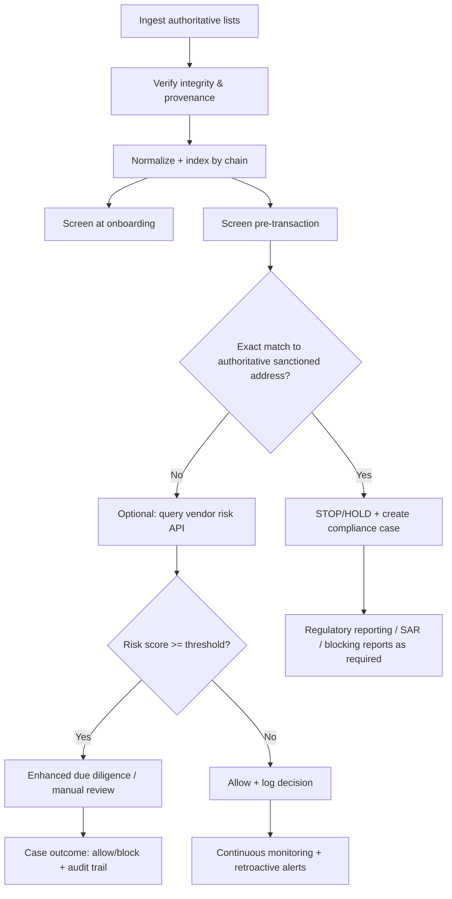

# Sanctioned Wallet Address Screening Sources (Sanctions OSINT + Official Lists)

# Credit
This guide was developed in collaboration with the team at [ttexchange.io](https://ttexchange.io). TT Exchange is a crypto / USDT on ramp service built for Trinidad and Tobago. They are VASP regulated in T&T ensuring safe compliant access to crypto markets.

A curated, compliance-first guide to **trusted sanctioned wallet address sources** and **how to integrate them** into a screening pipeline.

This repository is designed for **crypto companies, VASPs, fintechs, and financial institutions** that need a **defensible, auditable** approach to screening wallet addresses against sanctions and related restricted-party regimes.

> ⚠️ Not legal advice. Sanctions compliance is jurisdiction-specific. Use qualified counsel and compliance professionals.

---

## Purpose

1. Help teams identify the **highest-trust** sources for sanctioned crypto wallet identifiers (addresses).
2. Provide a **ready-to-implement** screening workflow (ingestion → matching → case management → audits).
3. Clarify **licensing / terms / redistribution** constraints so teams don't accidentally ship a compliance time bomb.

---

## Scope

This README covers:

- **Government / regulator sanctions lists** (OFAC, UN, EU, UK, Canada, etc.)
- **Guidance sources** (FATF standards and virtual asset guidance)
- **Reputable industry tools** that expose sanctions screening via API/UI (Chainalysis, TRM, Elliptic)
- **Reputable open-source projects** that extract OFAC "Digital Currency Address" identifiers and produce chain-specific lists

### Out of scope (by design)

- Publishing actual full sanctioned address dumps directly in this repo (licensing + misuse risk)
- Providing evasion techniques or operational guidance for wrongdoing
- Replacing your jurisdiction's legal requirements

--- 

## Assumptions (explicit)

These choices depend on your risk appetite and regulatory perimeter.

- **Target chains:** BTC + EVM (ETH and major L2s), and additional chains *only where sources explicitly support them*.
- **False-positive tolerance:**
  - Exact address matches to authoritative lists ⇒ treat as "STOP/HOLD + compliance case"
  - Entity/name matching or multi-hop exposure ⇒ risk-score thresholds + human review
- **Update cadence:** daily minimum for sanctions lists; more frequent where APIs permit

---

## Definitions

- **Sanctioned address (strict):** A blockchain address explicitly listed by a legal authority (e.g., OFAC SDN "Digital Currency Address - ETH …").
- **Sanctions exposure (broader):** Address clusters, indirect hops, or service ownership associated with sanctioned parties, even if not explicitly listed.
- **Authoritative source:** A government/regulator body or its official publication platform.
- **Derived source:** Any extraction, transform, mirror, or vendor enrichment built from authoritative sources.

---

## Quick start (recommended architecture)

### Two-layer screening model

1. **Authoritative exact-match layer**  
   - Use OFAC SDN "Digital Currency Address" fields as the highest-confidence on-chain sanctioned address list.
   - Block/hold on exact matches.
2. **Risk-based enrichment layer**  
   - Use vendor APIs or internal intelligence to detect:
     - address clustering
     - multi-hop exposure
     - typologies (mixers, ransomware cashouts, etc.)
   - Escalate based on thresholds.

---

## Screening workflow flowchart (Mermaid)



---

## Recommended risk thresholds (starter policy)

> Tune these to your regulator expectations, product risk, customer base, and jurisdiction.

| Situation | Default action | Risk score |
|---|---:|---:|
| Exact match to OFAC SDN "Digital Currency Address" | STOP/HOLD + case | 100 |
| Vendor confirms `isSanctioned=true` | STOP/HOLD + case | 100 |
| High-confidence cluster association to a sanctioned entity | STOP pending review | 80 |
| Multi-hop exposure above your configured taint threshold | Escalate / EDD | 60–80 |
| Weak OSINT-only label without corroboration | Monitor | 10–40 |

---

## Data hygiene and update cadence

Minimum controls for a defensible program:

- **Daily refresh** of authoritative lists (or faster if your risk requires it).
- **Immutable versioning:** store every ingested artifact with:
  - retrieval timestamp (UTC)
  - cryptographic hash
  - source URI
  - parser version / commit SHA
- **Integrity checks:**
  - prefer upstream checksums where provided (EU FSF includes checksums)
  - otherwise compute hash + pin official domains (allowlist)
- **Chain-aware canonicalization:** never compare addresses across chains.

---

## Code examples

### Python: exact-match screening (chain-aware canonicalization)

```python
import re

EVM_RE = re.compile(r"^0x[a-fA-F0-9]{40}$")

def canonicalize(chain: str, addr: str) -> str:
    chain = chain.upper().strip()
    a = addr.strip()
    if chain in {"ETH", "EVM", "ARB", "BSC"}:
        return a.lower()
    if chain in {"BTC", "XBT"} and a.lower().startswith(("bc1", "tb1", "bcrt1")):
        return a.lower()
    return a

def screen_exact(chain: str, addr: str, sanctioned_set: set[str]) -> bool:
    if chain.upper() in {"ETH", "EVM", "ARB", "BSC"} and not EVM_RE.match(addr.strip()):
        return False  # treat invalid syntax as non-hit; log separately
    return canonicalize(chain, addr) in sanctioned_set
```

### Pseudocode: handling false positives + audit

```text
if exact_match(authoritative_sanctioned_addresses, (chain, address)):
   stop_transaction()
   open_case(
      reason="authoritative sanctioned address exact match",
      evidence={
        "chain": chain,
        "address": address,
        "list_version": list_version_id,
        "source": "OFAC SDN digital currency address"
      }
   )
   notify_compliance()
else:
   if vendor_api_enabled:
      risk = vendor_screen(chain, address, tx_context)
      if risk.score >= threshold:
         hold_or_limit()
         open_case(reason="elevated risk", evidence=risk.evidence)
      else:
         allow()
log_all()
```

---

## Top authoritative sources (government / regulators / standards)

> URLs are provided as official landing pages or official download endpoints where possible.

### OFAC (United States) — **primary** for explicit sanctioned wallet addresses

| Field | Details |
|---|---|
| Official name | Office of Foreign Assets Control (OFAC) — Sanctions Lists (SDN) |
| URL | https://ofac.treasury.gov/sanctions-list-service  |
| Also | SDN list portal: https://sanctionslist.ofac.treas.gov/Home/SdnList  |
| Formats | CSV / XML (including "advanced" XML); see OFAC formats FAQ |
| Update frequency | Event-driven; can be sporadic; design daily+ polling |
| Licensing / restrictions | U.S. government work (generally public domain in U.S.); confirm site notices/logos |
| Trust / limitations | OFAC explicitly states digital currency address listings are *not exhaustive* |
| Verification methods | Official .gov domain, TLS, store hashes, prefer official distribution files |
| Integration approach | Prefer file ingestion (XML) + deterministic parsing; avoid scraping |

**Key OFAC address notes**
- SDN digital currency fields follow a consistent pattern: `Digital Currency Address - {ticker}` + address.
- Address search in OFAC Sanctions List Search is exact-match (no fuzzy logic on the ID field).

---

### United Nations — UNSC Consolidated List (authoritative names/entities)

| Field | Details |
|---|---|
| Official name | UN Security Council Consolidated List |
| URL | https://main.un.org/securitycouncil/en/content/un-sc-consolidated-list |
| Formats | XML / HTML / PDF |
| Update frequency | Event-driven; UN publishes an updates log |
| Licensing / restrictions | UN website terms/copyright apply; review before mirroring/redistribution |
| Trust / limitations | Highly authoritative for parties; generally not a wallet-address feed |
| Verification methods | Official UN domains; store hashes; capture "last updated" |
| Integration approach | XML ingestion; use for entity screening + mapping to on-chain intel |

Updates log:
- https://main.un.org/securitycouncil/en/content/list-updates-unsc-consolidated-list

---

### European Union — EU financial sanctions consolidated list (DG FISMA)

| Field | Details |
|---|---|
| Official name | European Commission — Financial sanctions consolidated list |
| URL | https://finance.ec.europa.eu/eu-and-world/sanctions-restrictive-measures/overview-sanctions-and-related-resources_en |
| Access | "Financial sanctions: Consolidated list" (FSF platform) via webgate.ec.europa.eu |
| Formats | XML / CSV / PDF (FSF documented) |
| Update frequency | "Whenever necessary" |
| Licensing / restrictions | Access/redistribution may be constrained; review EU legal notice/terms |
| Trust / limitations | Authoritative for EU freeze lists; wallet addresses generally not enumerated |
| Verification methods | Use FSF checksums where available; store hashes + provenance |
| Integration approach | Prefer official downloads + checksums; avoid scraping portals |

---

### United Kingdom — UK Sanctions List (UKSL)

| Field | Details |
|---|---|
| Official name | UK Sanctions List (FCDO) |
| URL | https://www.gov.uk/government/publications/the-uk-sanctions-list |
| Formats | ODT, ODS, XML, HTML, plus TXT, CSV, PDF |
| Update frequency | Event-driven; "Last Updated" field per entry |
| Licensing / restrictions | GOV.UK content generally under Open Government Licence v3.0 |
| Trust / limitations | Authoritative UK designation list; wallet addresses not guaranteed |
| Verification methods | Official GOV.UK + static URLs; store hashes; versioning |
| Integration approach | Prefer static URLs + file ingestion; do not scrape HTML |

Format guide:
- https://www.gov.uk/guidance/format-guide-for-the-uk-sanctions-list

---

### Canada — Consolidated Canadian Autonomous Sanctions List

| Field | Details |
|---|---|
| Official name | Consolidated Canadian Autonomous Sanctions List |
| URL | https://www.international.gc.ca/world-monde/international_relations-relations_internationales/sanctions/consolidated-consolide.aspx?lang=eng |
| Formats | HTML / PDF / XML |
| Update frequency | Event-driven; page includes "last updated" date and warns regulations may change frequently |
| Licensing / restrictions | Review Canada site terms |
| Trust / limitations | Administrative consolidation; not itself "force of law" |
| Verification methods | Official domain; store hashes; consider regulation reconciliation |
| Integration approach | XML ingestion + provenance; use for entity screening + mapping |

---

### FATF — standards and guidance (compliance expectations)

| Field | Details |
|---|---|
| Official name | FATF Updated Guidance for a Risk-Based Approach to Virtual Assets and VASPs (Oct 2021) |
| URL | https://www.fatf-gafi.org/en/publications/Fatfrecommendations/Guidance-rba-virtual-assets-2021.html |
| Formats | PDF (download) |
| Update frequency | Periodic guidance updates (not a list feed) |
| Licensing / restrictions | FATF site terms apply |
| Trust / limitations | Not a sanctions list; sets expectations for VASP AML/CFT controls incl. travel rule |
| Verification methods | Official fatf-gafi.org; store PDF hash + version |
| Integration approach | Use to design controls and risk framework; not for address matching |

---

### US consolidated restricted-party screening (names/entities)

| Field | Details |
|---|---|
| Official name | U.S. Consolidated Screening List (CSL) |
| URL | https://www.trade.gov/consolidated-screening-list |
| Formats | CSV / TSV / JSON + API |
| Update frequency | Automated updates (daily / hourly depending on endpoint) |
| Licensing / restrictions | Published as public domain (us-pd) in U.S. data catalogs |
| Trust / limitations | Helpful for restricted parties; not a wallet-address list |
| Verification methods | Official .gov endpoints; store hashes; cross-check sources |
| Integration approach | API for search + bulk downloads for indexing |

---

## Reputable industry sources (commercial / API-based)

> These providers generally offer **screening results** (sanction status, risk scoring, exposure) under contractual or proprietary terms.

### Chainalysis (API + on-chain oracle)

| Field | Details |
|---|---|
| Official name | Chainalysis — Free Crypto Sanctions Screening tools |
| URL | https://www.chainalysis.com/free-cryptocurrency-sanctions-screening-tools/ |
| Formats | API (OpenAPI available); on-chain oracle smart contract |
| Update frequency | "Regularly updated" (provider-managed); no guarantee of timeliness/accuracy |
| Licensing / restrictions | Terms apply; do not assume redistribution rights |
| Trust / limitations | Useful for operational screening; still requires your governance + audit trails |
| Verification methods | Provider status pages; log API responses; version oracle contract addresses |
| Integration approach | Backend API; for DeFi use oracle + allowlist contract addresses |

API docs (overview):
- https://auth-developers.chainalysis.com/sanctions-screening/api-reference/api-overview

Oracle docs:
- https://auth-developers.chainalysis.com/sanctions-screening/oracle/chainalysis-oracle/introduction

---

### TRM Labs (Sanctions API)

| Field | Details |
|---|---|
| Official name | TRM Sanctions API |
| URL | https://docs.sanctions.trmlabs.com/ |
| Formats | REST; JSON request/response; OpenAPI available |
| Update frequency | Provider-managed; check vendor SLA/terms |
| Licensing / restrictions | Explicitly proprietary |
| Trust / limitations | Designed for sanctions exposure screening; still not legal advice |
| Verification methods | Log request/response; monitor rate limit; store evidence |
| Integration approach | API call in transaction path + caching; respect rate limits |

---

### Elliptic (wallet screening)

| Field | Details |
|---|---|
| Official name | Elliptic Lens — Crypto Wallet Screening |
| URL | https://www.elliptic.co/platform/lens |
| Formats | UI + API (see provider API documentation links) |
| Update frequency | Provider-managed |
| Licensing / restrictions | Commercial terms apply |
| Trust / limitations | Broad coverage + labeling; treat as risk signal and store audit evidence |
| Verification methods | Vendor status pages + evidence capture |
| Integration approach | API integration for real-time screening + case management |

---

## Notable open-source / community projects (use with governance)

> These are best treated as **derived convenience layers** built from official sources.

### 0xB10C — OFAC sanctioned digital currency address extraction tool (MIT)

| Field | Details |
|---|---|
| Official name | ofac-sanctioned-digital-currency-addresses |
| URL | https://github.com/0xB10C/ofac-sanctioned-digital-currency-addresses |
| Formats | TXT (one address per line), JSON list |
| Update frequency | Repo publishes nightly generated lists (00:00 UTC) |
| Licensing / restrictions | MIT; no warranty |
| Trust / limitations | Derived from OFAC `sdn_advanced.xml`; may lag or contain parsing edge cases |
| Verification methods | Re-run extractor yourself from official OFAC XML; compare hashes |
| Integration approach | Prefer running extractor in your pipeline vs trusting a mirrored list |

---

### Ultrasoundmoney — Ethereum-only OFAC address list (MIT)

| Field | Details |
|---|---|
| Official name | ofac-ethereum-addresses |
| URL | https://github.com/ultrasoundmoney/ofac-ethereum-addresses |
| Formats | CSV + script |
| Update frequency | Repo-driven automation (see project CI) |
| Licensing / restrictions | MIT |
| Trust / limitations | Ethereum subset; involves additional extraction steps; validate provenance |
| Verification methods | Reproduce from OFAC sources; track truncated-row handling |
| Integration approach | Use as reference or reproduce pipeline internally |

---

### sambacha — ofac-list (fork/mirror)

| Field | Details |
|---|---|
| Official name | ofac-list |
| URL | https://github.com/sambacha/ofac-list |
| Formats | Pre-generated TXT/JSON lists + code |
| Update frequency | Varies by maintainer |
| Licensing / restrictions | Repo states MIT or Apache-2.0 |
| Trust / limitations | Mirror/fork convenience; ensure provenance and update automation |
| Verification methods | Compare against upstream OFAC XML + extractor |
| Integration approach | Prefer upstream + internal rebuild |

---

## Where "WalletExplorer" / "OXT" fit

These are commonly used as **investigative OSINT tooling** for attribution, not as official sanctions lists.

Recommended posture:
- Use them only as **supplementary context** in investigations (e.g., to support cluster hypotheses).
- Do not treat them as authoritative sanctions lists.
- Respect site terms; avoid aggressive scraping.

---

## Suggested repository structure

```
.
├── README.md
├── LICENSE
├── docs/
│   ├── sources.md              # deeper narrative & rationale
│   ├── normalization.md        # chain-specific canonicalization rules
│   └── governance.md           # controls, audits, case workflow
├── connectors/
│   ├── ofac_sdn_downloader.py
│   ├── ofac_sdn_parser.py
│   ├── uk_sanctions_downloader.py
│   ├── un_consolidated_downloader.py
│   └── eu_fsf_notes.md         # access + checksum + crawler notes
├── examples/
│   ├── screen_address.py
│   └── screen_transaction_pseudocode.txt
└── .github/
    └── workflows/
        └── update_lists.yml
```

---

## Suggested license for *this* repo

Recommended default: **MIT** for code + documentation.

Why:
- Maximizes reuse for compliance tooling.
- Aligns with several widely used open-source extractors.

Important:
- Do **not** commit proprietary vendor outputs.
- Be careful redistributing official list files whose terms are unclear (EU/UN). Prefer redistributing **connectors** and **parsers**, and downloading at runtime.

---

## Contributing

Contributions are welcome. Please:
- Ensure all sources are verifiable and authoritative
- Include provenance information for any new sources
- Follow the existing documentation structure
- Test any code examples before submitting

---

## Disclaimer

This repository provides guidance and tooling for sanctions screening. It is not legal advice. Sanctions compliance requirements vary by jurisdiction and change frequently. Consult qualified legal counsel and compliance professionals for your specific situation.

---

## License

MIT License - See LICENSE file for details
