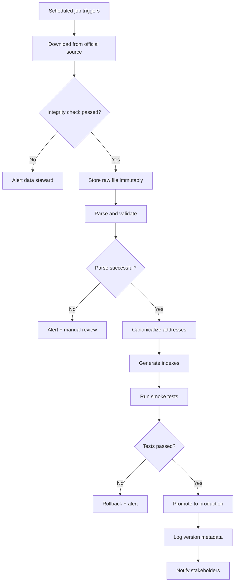
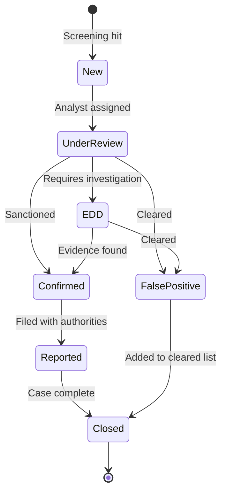

# Governance, Controls, and Case Workflow

This document outlines the operational controls, governance framework, and case management workflow for a sanctions screening program.

## Governance framework

### Roles and responsibilities

| Role | Responsibilities |
|---|---|
| **Compliance Officer** | Overall program ownership, policy approval, regulatory liaison |
| **Sanctions Analyst** | Daily operations, case review, escalations, reporting |
| **Engineering Lead** | System design, data pipeline, monitoring, incident response |
| **Data Steward** | List ingestion, version control, data quality, provenance |
| **Auditor** | Independent review, testing, documentation validation |

### Policies and procedures

Required documentation:
1. **Sanctions Screening Policy** - High-level approach, risk appetite, governance
2. **Standard Operating Procedures (SOPs)** - Step-by-step operational instructions
3. **Data Management Procedures** - List updates, versioning, integrity checks
4. **Case Management Procedures** - Workflow, escalation, documentation
5. **Audit and Testing Procedures** - Validation, sampling, reporting
6. **Incident Response Plan** - Handling system failures, data corruption, breaches

### Policy review and updates

- **Annual review** of all policies and procedures
- **Event-driven updates** when:
  - Regulatory requirements change
  - New sanctions regimes are added
  - System capabilities change
  - Audit findings require remediation

## Data management controls

### List ingestion workflow



### Version control requirements

Every list version must be tracked with:

```python
@dataclass
class ListVersion:
    version_id: str              # UUID
    source: str                  # "OFAC_SDN", "UN_CONSOLIDATED", etc.
    format: str                  # "XML", "CSV", etc.
    url: str                     # Download URL
    retrieved_at_utc: datetime   # When downloaded
    sha256: str                  # File hash
    parser_version: str          # Parser software version
    record_count: int            # Number of records parsed
    address_count: int           # Number of addresses extracted
    promoted_at_utc: datetime    # When promoted to production
    promoted_by: str             # User who promoted
    status: str                  # "active", "superseded", "failed"
```

### Integrity checks

**Before parsing:**
1. Verify TLS certificate (official domain)
2. Check file size (reject if suspiciously small/large)
3. Verify checksum if provided by source
4. Compute and store SHA-256 hash

**After parsing:**
1. Validate record count (reject if drops >10% from previous version)
2. Validate address count per chain
3. Check for duplicate addresses
4. Validate address formats
5. Run smoke tests against known sanctioned addresses

**Example smoke test:**
```python
KNOWN_SANCTIONED = [
    (Chain.ETHEREUM, "0x7f367cc41522ce07553e823bf3be79a889debe1b"),  # Tornado Cash
    # Add more known sanctioned addresses
]

def smoke_test(sanctioned_set):
    for chain, address in KNOWN_SANCTIONED:
        if (chain, address) not in sanctioned_set:
            raise ValueError(f"Smoke test failed: {chain}:{address} not found")
```

### Rollback procedures

If a new list version fails validation:
1. Do NOT promote to production
2. Alert data steward and engineering
3. Investigate root cause
4. Keep previous version active
5. Document incident

If a promoted version is found to be faulty:
1. Immediately rollback to previous version
2. Alert compliance and engineering
3. Review all decisions made with faulty version
4. File incident report
5. Implement corrective actions

## Screening controls

### Three-lines-of-defense model

**First line: Automated screening**
- Real-time checks at transaction time
- Deterministic rules for exact matches
- Risk scoring for indirect exposure

**Second line: Compliance review**
- Manual review of flagged cases
- Enhanced due diligence
- Escalation decisions

**Third line: Internal audit**
- Independent testing
- Sample validation
- Control effectiveness assessment

### Screening checkpoints

| Checkpoint | Timing | Action on hit |
|---|---|---|
| **Onboarding** | Before account activation | Block account creation |
| **Pre-transaction** | Before processing | Block transaction |
| **Post-transaction** | After processing (monitoring) | Freeze assets + report |
| **Periodic re-screening** | Monthly/quarterly | Review relationship |

### Risk-based thresholds

```python
class RiskLevel(Enum):
    CRITICAL = 100  # Exact match to authoritative list
    HIGH = 80       # High-confidence cluster/exposure
    MEDIUM = 50     # Moderate risk indicators
    LOW = 20        # Weak signals
    CLEAR = 0       # No indicators

class Action(Enum):
    BLOCK = "block"              # Reject immediately
    HOLD = "hold"                # Freeze pending review
    EDD = "enhanced_dd"          # Enhanced due diligence
    MONITOR = "monitor"          # Allow with monitoring
    ALLOW = "allow"              # Allow normally

RISK_POLICY = {
    RiskLevel.CRITICAL: Action.BLOCK,
    RiskLevel.HIGH: Action.HOLD,
    RiskLevel.MEDIUM: Action.EDD,
    RiskLevel.LOW: Action.MONITOR,
    RiskLevel.CLEAR: Action.ALLOW,
}
```

### False positive handling

**Causes of false positives:**
1. Name similarity (common names)
2. Partial matches
3. Data quality issues
4. Overly aggressive fuzzy matching

**Mitigation strategies:**
1. Use exact matching for addresses
2. Require multiple data points for entity matches
3. Maintain a "cleared" list of reviewed false positives
4. Document all false positive resolutions

**Cleared list management:**
```python
@dataclass
class ClearedEntry:
    subject_id: str              # Address or entity ID
    chain: Optional[Chain]       # If address
    flagged_reason: str          # Why it was flagged
    cleared_reason: str          # Why it was cleared
    cleared_by: str              # Analyst name
    cleared_at_utc: datetime     # When cleared
    review_date: datetime        # When to re-review
    supporting_docs: List[str]   # Document references
```

## Case management workflow

### Case lifecycle



### Case data model

```python
@dataclass
class Case:
    case_id: str                 # UUID
    created_at_utc: datetime
    subject_type: str            # "address", "entity", "transaction"
    subject_id: str              # Address, entity name, tx hash
    chain: Optional[Chain]
    
    # Screening details
    screening_timestamp: datetime
    list_versions: List[str]     # Version IDs used
    match_type: str              # "exact", "fuzzy", "cluster", "vendor"
    risk_score: int
    risk_factors: List[str]      # Reasons for flagging
    
    # Case management
    status: str                  # "new", "under_review", "edd", etc.
    assigned_to: str             # Analyst
    priority: str                # "critical", "high", "medium", "low"
    
    # Resolution
    resolution: Optional[str]    # "confirmed", "false_positive", "escalated"
    resolution_reason: str
    resolved_by: Optional[str]
    resolved_at_utc: Optional[datetime]
    
    # Actions taken
    actions: List[str]           # "blocked", "frozen", "reported", etc.
    
    # Documentation
    notes: List[str]
    attachments: List[str]       # File paths or URLs
```

### Case review SLA

| Priority | Initial review | Resolution target |
|---|---|---|
| Critical (exact OFAC match) | Immediate | 4 hours |
| High (vendor confirmed) | 1 hour | 24 hours |
| Medium (risk score 50-79) | 4 hours | 3 days |
| Low (risk score <50) | 24 hours | 7 days |

### Case documentation requirements

Every case must include:
1. **Screening evidence** - Match details, risk score, list versions
2. **Investigation notes** - Analyst findings, sources consulted
3. **Decision rationale** - Why confirmed or cleared
4. **Actions taken** - Block, freeze, report, etc.
5. **Supporting documents** - Screenshots, reports, correspondence
6. **Approvals** - Supervisor sign-off for high-risk cases

## Reporting and regulatory filings

### Internal reporting

**Daily:**
- Number of screening checks performed
- Number of hits by risk level
- Number of cases opened/closed
- System uptime and performance

**Weekly:**
- Case aging report
- False positive rate
- List update status
- Escalations and exceptions

**Monthly:**
- Comprehensive metrics dashboard
- Trend analysis
- Policy exceptions
- Training completion

**Quarterly:**
- Program effectiveness assessment
- Audit findings and remediation
- Regulatory changes impact
- Strategic recommendations

### Regulatory reporting

**OFAC reporting requirements (US):**

1. **Blocking reports** - Within 10 days of blocking property
2. **Rejected transaction reports** - Annual report by September 30
3. **Voluntary self-disclosure** - Promptly if apparent violation

**FinCEN SAR filing (US):**
- File within 30 days of detection
- Include narrative description
- Attach supporting documentation

**Other jurisdictions:**
- UK: Report to OFSI
- EU: Report to national competent authority
- Canada: Report to GAC

### Report templates

**Blocking report template:**
```
OFAC Blocking Report

1. Reporting Entity
   - Name: [Company name]
   - Address: [Address]
   - Contact: [Name, phone, email]

2. Blocked Property
   - Type: Digital currency
   - Chain: [Blockchain]
   - Address: [Wallet address]
   - Amount: [Value in crypto and USD]
   - Date blocked: [Date]

3. Sanctioned Party
   - Name: [SDN name]
   - SDN number: [Number]
   - Program: [Sanctions program]

4. Transaction Details
   - Date: [Date]
   - Description: [What was attempted]
   - Counterparty: [If known]

5. Actions Taken
   - [Description of blocking action]
   - [Current status of property]
```

## Audit and testing

### Annual audit scope

1. **Policy review** - Ensure policies are current and comprehensive
2. **Control testing** - Validate screening controls are effective
3. **Sample testing** - Review case decisions for accuracy
4. **Data quality** - Verify list integrity and versioning
5. **System testing** - Confirm technical controls function correctly
6. **Documentation review** - Ensure complete and accurate records

### Sample testing methodology

**Transaction sample:**
- Select random sample of transactions (e.g., 100 per month)
- Re-screen using current lists
- Compare results to original screening
- Investigate discrepancies

**Case sample:**
- Select random sample of cases (e.g., 25 per quarter)
- Review documentation completeness
- Validate decision rationale
- Confirm SLA compliance

**False positive sample:**
- Review all cleared cases
- Validate clearing rationale
- Confirm appropriate documentation
- Check for patterns indicating systemic issues

### Independent testing

Auditors should:
1. Obtain list versions used during audit period
2. Select test addresses (known sanctioned + control)
3. Run through screening system
4. Validate results match expectations
5. Test edge cases (case variations, invalid formats, etc.)

**Test cases:**
```python
TEST_CASES = [
    # Known sanctioned (should hit)
    ("ETH", "0x7f367cc41522ce07553e823bf3be79a889debe1b", True),
    
    # Known clean (should not hit)
    ("ETH", "0x0000000000000000000000000000000000000000", False),
    
    # Case variations (should hit if canonical form is sanctioned)
    ("ETH", "0x7F367CC41522CE07553E823BF3BE79A889DEBE1B", True),
    
    # Invalid format (should handle gracefully)
    ("ETH", "invalid", False),
    
    # Wrong chain (should not hit)
    ("BTC", "0x7f367cc41522ce07553e823bf3be79a889debe1b", False),
]

def run_audit_tests(screening_function):
    results = []
    for chain, address, expected_hit in TEST_CASES:
        actual_hit = screening_function(chain, address)
        passed = (actual_hit == expected_hit)
        results.append({
            'chain': chain,
            'address': address,
            'expected': expected_hit,
            'actual': actual_hit,
            'passed': passed
        })
    return results
```

## Training and awareness

### Required training

**All employees:**
- Sanctions overview
- Company policy
- Reporting obligations

**Compliance team:**
- Detailed sanctions regulations
- Screening system operation
- Case management procedures
- Regulatory reporting

**Engineering team:**
- Data pipeline operations
- System monitoring
- Incident response
- Data integrity controls

### Training frequency

- **Initial training** - Before system access granted
- **Annual refresher** - All personnel
- **Ad-hoc training** - When policies/systems change

### Training documentation

Maintain records of:
- Training materials and versions
- Attendance records
- Quiz/assessment results
- Acknowledgment signatures

## Incident response

### Incident types

1. **System failure** - Screening system down or malfunctioning
2. **Data corruption** - List data compromised or incorrect
3. **False negative** - Sanctioned party not detected
4. **Unauthorized access** - Security breach
5. **Regulatory violation** - Apparent sanctions violation

### Incident response plan

**Immediate actions (0-1 hour):**
1. Identify and contain incident
2. Notify incident response team
3. Preserve evidence
4. Implement workaround if possible

**Short-term actions (1-24 hours):**
1. Investigate root cause
2. Assess impact (transactions, customers, exposure)
3. Notify senior management
4. Determine if regulatory notification required

**Medium-term actions (1-7 days):**
1. Implement corrective actions
2. File regulatory reports if required
3. Communicate with affected parties
4. Document incident thoroughly

**Long-term actions (7+ days):**
1. Conduct post-incident review
2. Update policies/procedures
3. Implement preventive controls
4. Provide additional training if needed

### Incident documentation

```python
@dataclass
class Incident:
    incident_id: str
    detected_at_utc: datetime
    detected_by: str
    incident_type: str
    severity: str                # "critical", "high", "medium", "low"
    
    description: str
    root_cause: str
    impact_assessment: str
    
    actions_taken: List[str]
    corrective_actions: List[str]
    preventive_actions: List[str]
    
    regulatory_notification: bool
    notification_details: Optional[str]
    
    resolved_at_utc: Optional[datetime]
    resolved_by: Optional[str]
    
    lessons_learned: str
    policy_updates: List[str]
```

## Continuous improvement

### Metrics to track

**Operational metrics:**
- Screening volume (checks per day)
- Hit rate (% of checks that flag)
- False positive rate
- Case resolution time
- SLA compliance rate

**Quality metrics:**
- List update timeliness
- Data integrity issues
- System uptime
- Audit findings

**Risk metrics:**
- Value of blocked transactions
- Number of confirmed sanctions matches
- Retroactive hits (addresses sanctioned after transaction)

### Performance targets

| Metric | Target |
|---|---|
| System uptime | 99.9% |
| List update lag | <24 hours |
| False positive rate | <5% |
| Critical case resolution | <4 hours |
| High case resolution | <24 hours |
| Audit findings | 0 critical, <3 high |

### Continuous improvement process

1. **Monthly review** - Review metrics, identify trends
2. **Quarterly assessment** - Evaluate program effectiveness
3. **Annual strategic review** - Major policy/system updates
4. **Ongoing optimization** - Tune thresholds, improve processes

## Documentation retention

Retain all records for **7 years** (or longer if required by jurisdiction):
- Screening logs
- Case files
- List versions
- Policy documents
- Training records
- Audit reports
- Incident reports
- Regulatory correspondence

Use immutable storage where possible (WORM - Write Once Read Many).

## Summary checklist

- [ ] Governance framework documented
- [ ] Roles and responsibilities assigned
- [ ] Policies and procedures approved
- [ ] Data management controls implemented
- [ ] Version control system operational
- [ ] Integrity checks automated
- [ ] Screening thresholds configured
- [ ] Case management workflow defined
- [ ] SLAs established and monitored
- [ ] Reporting templates prepared
- [ ] Audit plan developed
- [ ] Training program implemented
- [ ] Incident response plan documented
- [ ] Metrics dashboard operational
- [ ] Documentation retention policy enforced
